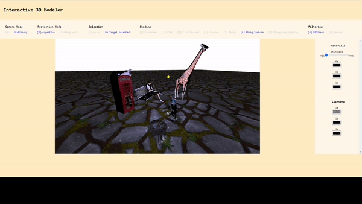
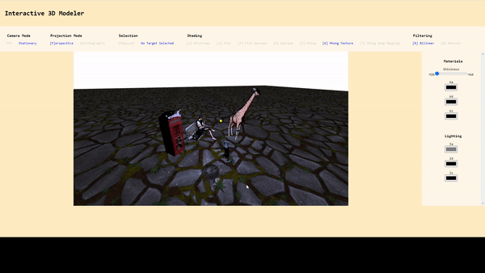

# 3D Interactive Modeler 

This is a project I did for a computer graphics class at UC Davis. The purpose of the project was to learn about the different graphics techniques involved in computer graphics. The main concepts were about transformations, shading, texture mapping, lighting, and image filtering. 
Since this project was done a while ago, proper texture mapping maybe outdated. The project is done mainly with javascript using the webgl2 features. Additionally, some of the shading components are implemented using the OpenGL shading language. 

In order to interactive with the project itself, the user can create a scene by making a json file. 
The scene will get render by inputting the json file into the main.js file. 

During the process of viewing it, the user can interact with the scene itself. Holding left click and moving rotates the scene. Holding right click and moving scales the scene. 

The user may also press various inputs to change various things about the scene itself. 

## Dependencies 
Webgl2, Live Server extension on VS code 

## To run this project 

To able to run this project, first download this project. Since there is no server side setup, using the VS code live server extension greatly helps instantly create a live server to view the index.html. Therefore, you would open this project using VS code and run the live server extension to view the project. 